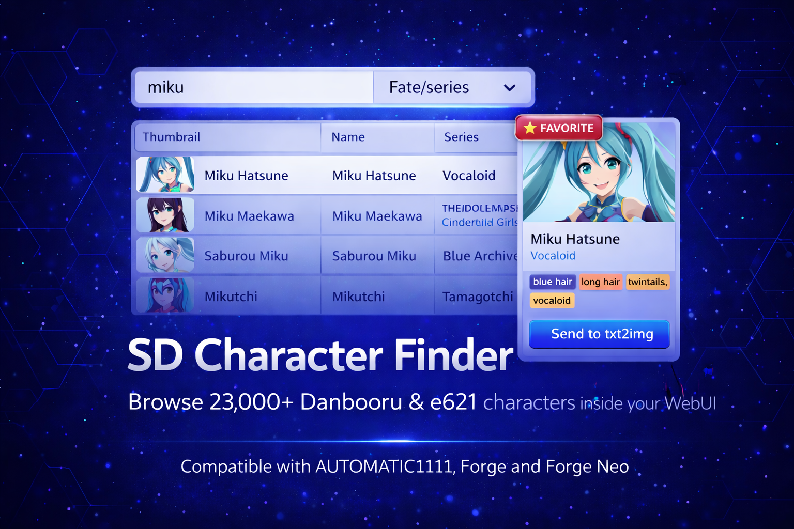

# 🎭 SD Character Finder

> **Extension for [Stable Diffusion WebUI](https://github.com/AUTOMATIC1111/stable-diffusion-webui) and [Forge](https://github.com/Haoming02/sd-webui-forge-classic/tree/neo)**

> **Can't remember the exact tag for that specific character? Want to generate an image from a series and discover tags you didn't even know existed? Say no more!** 🦸‍♂️

Your ultimate character encyclopedia directly inside your Stable Diffusion WebUI. Browse over **20,000+ Danbooru characters** without leaving your UI, search by name, tag, or series, preview their thumbnails, and send their perfect prompt tags straight to `txt2img` with a single click!

---

## 📋 Table of Contents

- [What's New](#-whats-new)
- [Changelog](#-changelog)
- [Roadmap](#️-roadmap)
- [Features](#-features)
- [Installation](#-installation)
- [Quick Start](#-quick-start)
- [Credits](#-credits)

---

## 🆕 What's New

### v0.2.0 — Beautiful Layout, Categories & Logic Override
- **Sleek UI Remaster** — Fully remade the interface taking advantage of horizontal layout capabilities. The character attributes and thumbnail now sit cleanly on the left while results populate on your right.
- **Categorical Extra Tags** — Now, clicking "Fetch Extra Tags" neatly sorts all live-fetched Danbooru attributes into distinct checkboxes (Character, Series, General, Meta).
- **NovelAI Tag Ordering** — The algorithm behind tag injections now flawlessly forces ideal syntax orders (`1girl`, `character`, `series`, `everything else`) for much stronger promping results.
- **User Overrides Persistence** — Your local changes to labels and DB saves now persist accurately to a local `user_overrides.json`, keeping you completely safe from `git pull` overwrites when updating the tool!
- **Target Folder Cleaner** — Cleaned up wildcards output. The extension now grabs its default Wildcard backup location directly from a global WebUI Setting option!

---

## 📖 Changelog

### v0.1.0 — Huge UX Improvements
- **Add to txt2img Button** — A new action button that intelligently appends tags to your existing prompt without wiping it, automatically preventing duplicate words!
- **Live Danbooru Enrichment** — Added an optional section to fetch extra tags dynamically from Danbooru (like clothes, hair, eyes) with neat checkboxes.
- **Clear Button** — Added a simple one-click reset for your search query and results table.

### v0.0.1 — Initial Release
- **Offline Library** — Shipped with an embedded lightweight database containing 20,016 Danbooru characters.
- **Quick Integration** — Works out of the box with AUTOMATIC1111, Forge, and Forge Classic (Neo).
- **Core Functionality** — Search by name or tag, filter by series, view character cards, and send prompts straight to generation.

---

## 🗺️ Roadmap

### v0.1.0 — Huge UX Improvements *(complete)* ✅

### v0.2.0 — Big Cleanup & Polish *(complete)* ✅

### v0.2.0 — UI Overhaul, Live API & Offline Caching *(complete)* ✅
- Total layout overhaul (Split screen logic, Thumbnail on the left).
- Better structure separating Danbooru 'Extra tags' dynamically by category (Character, Copyright, General, Artist and Meta).
- Accurate default tag ordering mimicking NovelAI's preferred weighting style.
- Full internal DB persistency using local files to avoid conflicts.
- Local Base64 Image Caching in `data/covers/` directory to prevent bandwidth usage and timeouts.

### v0.3.0 — Custom User Series & Collections *(planned)*
- Save custom character tags globally.
- Custom Collections & Favorites system to quickly access and filter your top tier characters.
- **Danbooru Artist & Style Browser** — Explore artists and styles directly.
  - *Note: e621 tags/character support might also be added in the future if requested by the community!*

---

## 🎯 Features

> ⭐ = Core Highlights

### 🔍 Browse & Search
- Browse **20,000+ characters** directly inside the WebUI — no tab switching to Danbooru ⭐
- Search by character name, tag, or browse alphabetically by series/franchise
- High-performance offline SQLite database ensures instant search results without internet dependence ⭐
- Pagination system keeps the UI snappy even when returning thousands of results

### 🖼️ Character Info & Preview
- View high-quality character thumbnails instantly.
- Expandable **Live Danbooru Tags** menu: dynamically fetch extra character-specific tags from Danbooru (like clothes, eyes, hair) separated into explicit selectable Checkboxes by Category (Copyright, Character, General, Artist, Meta) ⭐
- Automatically sorts appended web-tags following optimal generation standards (NovelAI style formatting).
- Clean, translation-ready interface integrating straight into A1111/Forge standard inputs.

### 🚀 One-Click Prompting
- **Send to Generate** — Instantly replaces your current 	xt2img prompt with the character's signature tags
- **Add to txt2img** — Intelligently appends the character tags to your *existing* prompt ⭐
- **Smart Deduplication** — Automatically removes duplicate words when sending tags to your prompt

### ⚙️ Configuration
- Fully integrated with the native WebUI settings menu (Settings -> Options -> SD Character Finder)
- Configure results per page, Danbooru API credentials, and default behaviors
- Fast, lightweight, and completely localized

---

## 📦 Installation

### Inside SD WebUI (Recommended)

1. Open your WebUI and go to the **Extensions** tab.
2. Click on the **Install from URL** sub-tab.
3. Paste: https://github.com/eduardoabreu81/sd-character-finder
4. Click **Install**.
5. Go to the **Installed** sub-tab and click **Apply and restart UI**.

> ⚠️ Compatible with AUTOMATIC1111, Forge, and Forge Classic / Neo.

---

## 🚀 Quick Start

1. Go to the new **Danbooru Characters** tab in your WebUI.
2. Type a character name or tag (e.g., miku, saber, blue hair), or pick a series from the **Series Dropdown** (e.g., Arknights).
3. Click **🔍 Search**.
4. Click on any character in the results table to see their preview card and tags.
5. Expand **Extra tags** if you want to pull more specific prompt descriptors directly from the web.
6. Click **➡️ Send to Generate** or **➕ Add to txt2img** to instantly fill your prompt!

---

## 📄 Credits

- **[Danbooru](https://danbooru.donmai.us/)** — For maintaining the incredible tag database and API this project relies upon.
- **[NoobAI-XL / Danbooru Character](https://www.downloadmost.com/NoobAI-XL/danbooru-character/)** — Inspiration and reference for Danbooru character tagging.
- **[Danbooru-Tags-Sort-Exporter](https://github.com/Takenoko3333/Danbooru-Tags-Sort-Exporter)** by Takenoko3333 — Inspiration for the NovelAI-like tag sorting logic.

---

## 📜 License

MIT — see [LICENSE](LICENSE)

---

Made with ❤️ for the Stable Diffusion community

**[Report Bug](https://github.com/eduardoabreu81/sd-character-finder/issues)** • **[Request Feature](https://github.com/eduardoabreu81/sd-character-finder/issues)** • **[Discussions](https://github.com/eduardoabreu81/sd-character-finder/discussions)** • **[☕ Ko-fi](https://ko-fi.com/eduardoabreu81)**

