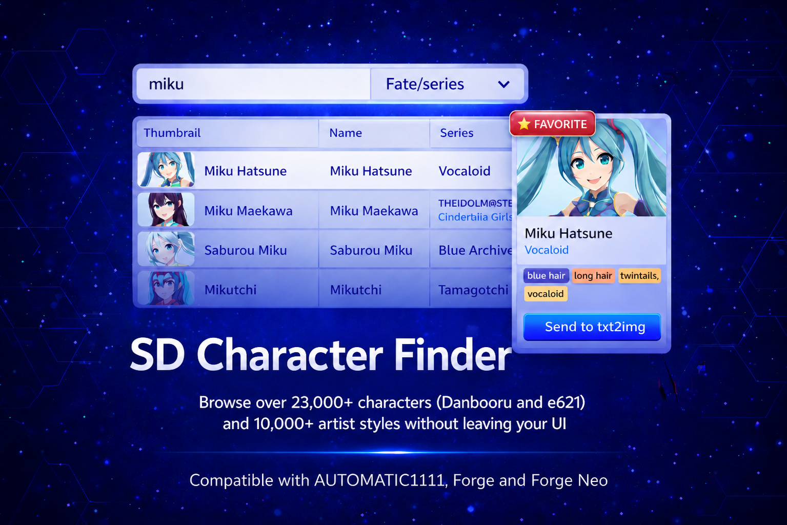

# 🎭 SD Character Finder

> **Extension for [Stable Diffusion WebUI](https://github.com/AUTOMATIC1111/stable-diffusion-webui) and [Forge](https://github.com/Haoming02/sd-webui-forge-classic/tree/neo)**

> **Can't remember the exact tag for that specific character? Want to discover a new art style and completely change the look of your generations? Say no more!** 🦸‍♂️

Your ultimate **character encyclopedia** and **artist style discovery** tool directly inside your Stable Diffusion WebUI. Browse over **23,000+ characters** (Danbooru and e621) and **10,000+ artist styles** without leaving your UI — search characters by name, tag, or series; discover unique art styles with real-time previews; and send both character tags and artist signatures straight to `txt2img` with a single click!

---

## 📋 Table of Contents

- [What's New](#-whats-new)
- [Changelog](#-changelog)
- [Roadmap](#️-roadmap)
- [Features](#-features)
- [Installation](#-installation)
- [Quick Start](#-quick-start)
- [Credits](#-credits)

---

## 🆕 What's New

### v0.6.0 — Artist Style Discovery
- **🎨 MAJOR UPDATE — Artist Style Browser!** Discover and apply **10,000+ artist styles** (6,000+ Danbooru + 4,000+ e621). Browse visually, add the artist's tag with one click, and watch the magic happen — your generation's art style transforms instantly.
- **Dual-Preview Cards** ⭐ — Every artist shows two side-by-side examples (e.g., *Tifa Lockhart* and *Harry Potter* both rendered in that artist's unique style) so you can instantly see how their drawing technique looks applied to different subjects before adding it to your prompt.
- **Separate Settings** — Artists have their own pagination limit, thumbnail size, and column count settings independent from characters.
- **Security Improvements** — Fixed potential vulnerabilities in gallery rendering and image downloads.

---

## 📖 Changelog

### v0.5.3 — Hotfix: Startup Crash & Database Lock
- **Startup Crash Fix** — Fixed a `NameError` crash that prevented the Gradio extension from initializing on remote WebUI instances (like RunPod) after the recent pagination updates.
- **Database Lock Fix** — Disabled WAL mode and added an automatic cleanup routine for orphaned `.db-wal` and `.db-shm` files. This permanently prevents the `database disk image is malformed` error that occurred when updating the extension via `git pull` on remote servers.
- **Gallery History Click** — Fixed issue where clicking a character in the "Recently Viewed" list wouldn't load their details.

### v0.5.2 — History Pagination, Auto-Select & DB Series Rescue
- **DB Series Rescue** — Automatically fixed 709 popular characters (including Konosuba, JoJo, Re:Zero) that were missing their franchise metadata entirely by extracting and standardizing their 2nd copyright tag.
- **Recently Viewed Extended** — Increased history retention limit from 20 to 100 characters and added independent, fully functional pagination controls exclusively inside the "Recently Viewed" tab.
- **Auto-Select Search Results** — Submitting a search now automatically selects and loads the preview image and attributes of the first resulting character, saving you an extra click.

### v0.5.1 — Global Pagination & Forge State Saving
- **Global Pagination** — Pagination controls (top and bottom) are now truly global, existing outside the "Search Results" tab. This allows seamless page navigation across any visible tab (Search, History, etc.) without losing context.
- **Forge State Saving** — Added permanent `elem_id` hooks to all key inputs (Search, Series, Dropdowns). This allows AUTOMATIC1111/Forge's native "Save UI Defaults" feature to reliably serialize and restore your exact filter state across reboots.
- **Search Reset Fixes** — Fixed a bug where clicking "Clear Search" or "Clear All" would break the Series dropdown by setting it to `None`. It now correctly resets back to the `"All"` state.

### v0.5.0 — Favorites, History & UI Polish
- Added visual and database-backed "Favorites" marking logic (`data/favorites.json`).
- Added full "Recent Searches" and "Favorites" isolated tabs.
- Custom Svelte DOM styling to patch Gradio 4 Dataframe artifacts (hidden drag rows, clean outlines).
- Completely removed startup automatic scraping from UI entrypoints. `data/characters.db` serves as authority unless updated actively by git/scripts.
- Custom `-webkit-scrollbar` UI overrides integrated with WebUI's core variable themes.

### v0.4.2 — Background Scraping Removed
- Extracted automated scraping triggers on extension load. Fixed startup freezing loops dynamically.

### v0.4.1 — Reliability, Dedupe Control & Startup Sync
- Added `Add to txt2img: Deduplicate incoming tags` option to native WebUI Settings.
- `Add to txt2img` now supports both modes: deduplicated append and raw append.
- Improved startup auto-scrape consistency for both Danbooru and e621 sources.
- Hardened SQLite runtime behavior (WAL, busy timeout, synchronous normal).
- Improved gallery performance by reusing requests session and caching data URIs in memory.

### v0.4.0 — Unified Database, e621 Support & UX Boosts
- **e621 Integration** — Unified database now includes 3,000+ e621 characters alongside Danbooru.
- **Source Filter + Badges** — Added Danbooru/e621/both filtering and visual source badges.
- **Recently Viewed Panel** — Added quick-access history for the most recently opened characters.
- **Advanced Multi-Term Search** — Search now applies AND logic for multiple keywords.
- **Background Auto-Scraper** — Startup recovery flow for missing/incomplete datasets.

### v0.3.2 — Gallery Customization & Auto-Switch
- Added WebUI settings for gallery thumbnail size and cards per row.
- Added automatic tab switch to `txt2img` when using Send/Add actions.

### v0.3.1 — Stable Gallery Cards + Expandable Preview
- **Custom Card Gallery** — Replaced Gradio Gallery rendering with a custom HTML card grid for predictable desktop/mobile behavior.
- **Reliable Card Selection** — Clicking a card now consistently loads character data and tags.
- **Large Expandable Preview** — Side preview now includes an in-image hint (`Click to expand`) and opens a large modal/lightbox when clicked.
- **Safer Pagination Control** — Results-per-page is configurable in Settings with a stable range (`5..30`, hard cap at `30`).

### v0.3.0 — Visual Search Gallery Mode
- **Visual Browser** — Added a brand new "Gallery View" tab to the search results! You can now toggle between seeing results as a compact List or a visual Grid showing thumbnails of all characters simultaneously. Powered by safe, fast CDN links (no Danbooru rate-limits!).

### v0.2.3 — Gradio 3 Backward Compatibility
- Fixed an issue causing crashes on Forge Classic due to unsupported js keyword arguments by enforcing _js when invoked under older Gradio runtimes.

### v0.2.2 — Forge Classic Startup Fix (Part 2)
- **Settings Parser Fix** — Explicitly mapped `float` config values to Gradio Slider components to prevent startup crashes on older or parallel forks (e.g. Forge Classic) where global UI parsing failed during boot.

### v0.2.1 — Forge Classic Startup Fix (Part 1)
- **Settings Parser Fix** — Explicitly mapped `float` config values to Gradio Slider components to prevent startup crashes on older or parallel forks.

### v0.2.0 — Beautiful Layout, Categories & Logic Override
- **Sleek UI Remaster** — Fully remade the interface taking advantage of horizontal layout capabilities. The character attributes and thumbnail now sit cleanly on the left while results populate on your right.
- **Categorical Extra Tags** — Now, clicking "Fetch Extra Tags" neatly sorts all live-fetched Danbooru attributes into distinct checkboxes (Character, Series, General, Meta).
- **NovelAI Tag Ordering** — The algorithm behind tag injections now flawlessly forces ideal syntax orders (`1girl`, `character`, `series`, `everything else`) for much stronger promping results.
- **User Overrides Persistence** — Your local changes to labels and DB saves now persist accurately to a local `user_overrides.json`, keeping you completely safe from `git pull` overwrites when updating the tool!
- **Target Folder Cleaner** — Cleaned up wildcards output. The extension now grabs its default Wildcard backup location directly from a global WebUI Setting option!

### v0.1.0 — Huge UX Improvements
- **Add to txt2img Button** — A new action button that intelligently appends tags to your existing prompt without wiping it, automatically preventing duplicate words!
- **Live Danbooru Enrichment** — Added an optional section to fetch extra tags dynamically from Danbooru (like clothes, hair, eyes) with neat checkboxes.
- **Clear Button** — Added a simple one-click reset for your search query and results table.

### v0.0.1 — Initial Release
- **Offline Library** — Shipped with an embedded lightweight database containing 20,016 Danbooru characters.
- **Quick Integration** — Works out of the box with AUTOMATIC1111, Forge, and Forge Classic (Neo).
- **Core Functionality** — Search by name or tag, filter by series, view character cards, and send prompts straight to generation.

---

## 🗺️ Completed Milestones

### v0.1.0 — Huge UX Improvements ✅

### v0.2.0 — UI Overhaul, Live API & Offline Caching ✅
- Total layout overhaul (Split screen logic, Thumbnail on the left).
- Better structure separating Danbooru 'Extra tags' dynamically by category (Character, Copyright, General, Artist and Meta).
- Accurate default tag ordering mimicking NovelAI's preferred weighting style.
- Full internal DB persistency using local files to avoid conflicts.
- Local Base64 Image Caching in `data/covers/` directory to prevent bandwidth usage and timeouts.

### v0.3.1 — Visual Search Stabilization ✅
- Replaced unstable Gradio gallery layout with custom HTML card grid.
- Added card-click selection bridge with consistent behavior across desktop/mobile.
- Added large modal preview (`Click to expand`) from side preview.

### v0.3.2 — Gallery Customization & Auto-Switch ✅
- Exposed thumbnail size and cards-per-row options in WebUI Settings.
- Added automatic tab switching to `txt2img` when sending or appending tags.

### v0.4.0 — e621 Support & Search UX ✅
- Optional e621 support (Unified Database with >3000 characters & Source Filter).
- Recently Viewed history panel for quick character hopping.
- Multi-term `AND` search logic.

### v0.5.0 — Favorites, History & UI Polish ✅
- Favorites system with JSON persistence.
- Recently Viewed history panel for quick character hopping.
- Global pagination controls across all tabs.
- Forge "Save UI Defaults" support.

### v0.6.0 — Artist Style Discovery ✅
- **10,000+ artist styles** with dual-preview cards.
- Top-level Artists tab separate from Characters.
- Visual style discovery with side-by-side previews.
- One-click artist tag injection into prompts.
- Separate pagination and display settings for artists.

---

## 🎯 Features

> ⭐ = Core Highlights

### 🔍 Browse Characters
- Browse **23,000+ characters** (20,000+ Danbooru and 3,000+ e621) directly inside the WebUI — no tab switching! ⭐
- Search by character name, tag, or browse alphabetically by series/franchise
- Use multiple keywords for precise filtering (e.g., `miku vocaloid` ensures both terms exist)
- Track your session with **Recent searches** and **Favorites** Tabs directly synced local-first. ⭐
- High-performance offline SQLite database ensures instant search results without internet dependence ⭐
- Pagination system keeps the UI snappy even when returning thousands of results

### 🎨 Discover Artist Styles *(NEW in v0.6.0)*
- Browse **10,000+ artist styles** (6,024 Danbooru + 4,032 e621) in a dedicated Artists tab ⭐
- **Dual-preview cards** — Every artist shows two side-by-side examples (e.g., Tifa Lockhart style + Harry Potter style) so you can visually compare their drawing technique before applying it ⭐
- **Visual discovery** — Don't know an artist's name? Just browse the gallery and "scroll until something clicks" — thumbnails make discovering new styles effortless
- **One-click apply** — Click any card, then hit **Add to txt2img** to inject `by artist_name` straight into your prompt
- **Favorites for artists** — Save your favorite art styles for quick access, separate from character favorites
- Separate pagination, thumbnail size, and column settings for the Artists gallery

### 🖼️ Character Info & Preview
- View high-quality character thumbnails instantly (with color-coded Source Badges).
- Stable visual card grid in **Gallery View** with responsive layout (desktop and mobile).
- **Recently Viewed** panel tracks your last clicked characters and artists.
- Click any card to load details and prompt tags.
- Side preview supports **Click to expand** and opens a large modal image.
- Expandable **Live Danbooru Tags** menu: dynamically fetch extra character-specific tags from Danbooru (like clothes, eyes, hair) separated into explicit selectable Checkboxes by Category ⭐
- Automatically sorts appended web-tags following optimal generation standards (NovelAI style formatting).
- Clean, translation-ready interface integrating straight into A1111/Forge standard inputs.

### 🚀 One-Click Prompting
- **Send to Generate** — Instantly replaces your current `txt2img` prompt and **automatically switches you to the tab**.
- **Add to txt2img** — Intelligently appends tags to your *existing* prompt ⭐
- **Smart Deduplication** — Automatically removes duplicate words when enabled in Settings
- Supports both **Character tags** and **Artist style tags** seamlessly

### ⚙️ Configuration
- Fully integrated with the native WebUI settings menu (Settings -> Options -> SD Character Finder)
- Configure results per page for **Characters** and **Artists** independently
- **Thumbnail sizes, cards per row**, deduplication behavior, Danbooru API credentials, and default behaviors
- Fast, lightweight, and completely localized

---

## 📦 Installation

### Inside SD WebUI (Recommended)

1. Open your WebUI and go to the **Extensions** tab.
2. Click on the **Install from URL** sub-tab.
3. Paste: https://github.com/eduardoabreu81/sd-character-finder
4. Click **Install**.
5. Go to the **Installed** sub-tab and click **Apply and restart UI**.

> ⚠️ Compatible with AUTOMATIC1111, Forge, and Forge Classic / Neo.

---

## 🚀 Quick Start

1. Go to the new **Characters** tab in your WebUI.
2. Type a character name or tag (e.g., miku, saber, blue hair), or pick a series from the **Series Dropdown** (e.g., Arknights).
3. Click **🔍 Search**.
4. Click on any character card to see their preview and tags.
5. Click **➡️ Send to Generate** or **➕ Add to txt2img** to instantly fill your prompt!

### 🎨 Discovering Artist Styles
1. Switch to the **Artists** tab.
2. Browse the gallery visually — each card shows two style examples side-by-side.
3. Found a style you like? Click the card to load the artist's tag.
4. Click **➕ Add to txt2img** to inject `by artist_name` into your prompt.
5. Combine character + artist for unique generations!

---

## 📄 Credits

- **[Danbooru](https://danbooru.donmai.us/)** — For maintaining the incredible tag database and API this project relies upon.
- **[NoobAI-XL / Danbooru Character](https://www.downloadmost.com/NoobAI-XL/danbooru-character/)** — Inspiration and reference for Danbooru character tagging.
- **[Danbooru-Tags-Sort-Exporter](https://github.com/Takenoko3333/Danbooru-Tags-Sort-Exporter)** by Takenoko3333 — Inspiration for the NovelAI-like tag sorting logic.

---

## 📜 License

MIT — see [LICENSE](LICENSE)

---

Made with ❤️ for the Stable Diffusion community

**[Report Bug](https://github.com/eduardoabreu81/sd-character-finder/issues)** • **[Request Feature](https://github.com/eduardoabreu81/sd-character-finder/issues)** • **[Discussions](https://github.com/eduardoabreu81/sd-character-finder/discussions)** • **[☕ Ko-fi](https://ko-fi.com/eduardoabreu81)**

